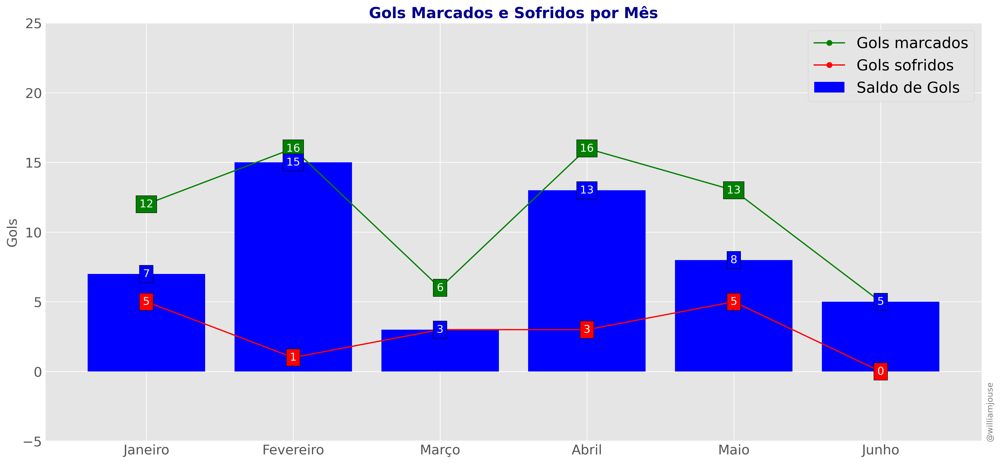
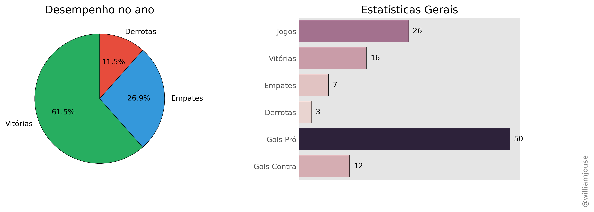
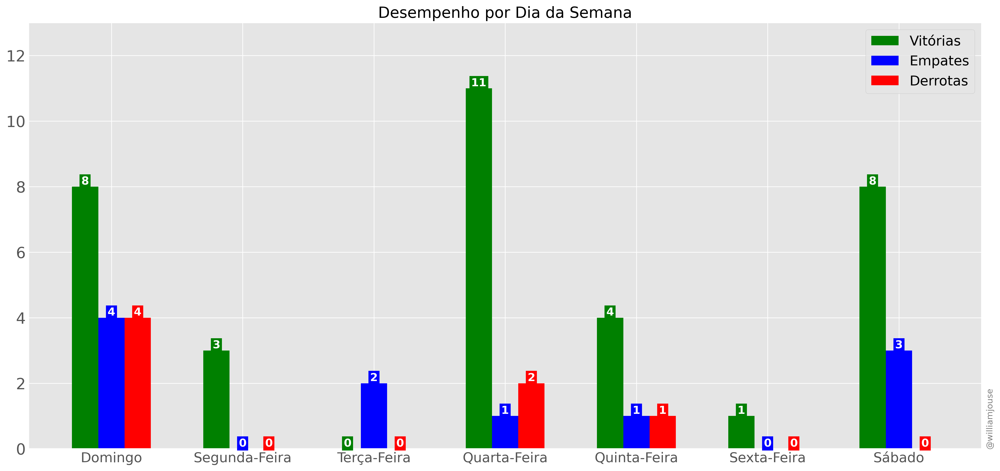

# 🔴⚫ Jogos do Flamengo temporada 2025

Bem-vindo ao repositório **Jogos do Flamengo**! Este projeto contém dados e 
sobre as partidas da temporada 2025 do Flamengo.

## 📋 Descrição

Este repositório contém dados e scripts que auxiliam na coleta, organização e análise de informações sobre os jogos do Flamengo, incluindo:

- Resultados de partidas
- Adversários
- Datas e locais dos jogos
- Gols marcados e sofridos
- Estádio, público

## 🚀 Funcionalidades

- Acesso a um banco de dados de jogos da temporada 2025
- Estatísticas das partidas
- Artilharia e assistência dos jogadores 
- Visualização dos gols sofridos e marcados
- Comparação de desempenho em diferentes campeonatos
- Desempenho por mês
- Visualização de estatísticas dos jogadores e da equipe

## 📦 Estrutura do Repositório

A estrutura básica do repositório é a seguinte:

```bash
/
├── data/raw/        # Arquivos CSV com os dados dos jogos
├── notebooks/       # Jupyter notebooks com análises
├── figures/         # Gráficos e outras imagens
└── README.md        # Documentação principal
```

## ⚙️ Tecnologias Utilizadas

- Python: Linguagem principal para coleta e processamento de dados
- Pandas: Biblioteca para manipulação de dados
- Matplotlib/Seaborn: Visualização de gráficos e estatísticas
- Jupyter Notebook: Para criar e compartilhar análises

## 🗂️ Fontes de Dados

Os dados dos jogos do Flamengo podem ser obtidos de várias fontes, como:

- [Sofascore](https://www.sofascore.com/)
- [Fotmob](https://www.fotmob.com/)
- [ge](https://ge.globo.com/)
- [Flashscore](https://www.flashscore.com)


## Estatísticas

```
Jogos: 36
Vitórias: 23
Empates: 9
Derrotas: 4*
Gols pro: 68
Gols contra: 17
Saldo de gols: +51
Gols/jogo: 1.89
Gols sofridos/jogo: 0.47
Jogos em que marcou: 30
Jogos em que sofreu gol: 12 
Aproveitamento: 72.22%
Aproveitamento pontos: 78/108

*Filipe Luis tem apenas 2 derrota no ano.


```
| Jogador           |   Gols |   Assistências |
|:------------------|-------:|---------------:|
| Arrascaeta        |     12 |              6 |
| Luiz Araújo       |      7 |              5 |
| Bruno Henrique    |      6 |              1 |
| Pedro             |      5 |              3 |
| Wallace Yan       |      4 |              2 |
| Carlinhos         |      3 |              0 |
| Everton Cebolinha |      3 |              2 |
| Juninho           |      3 |              0 |
| Léo Ortiz         |      3 |              1 |
| Michael           |      2 |              4 |
| Matheus Gonçalves |      2 |              0 |
| Léo Pereira       |      2 |              0 |
| Danilo            |      2 |              1 |
| Alcaraz           |      1 |              0 |
| Plata             |      1 |              3 |


## Gráficos








