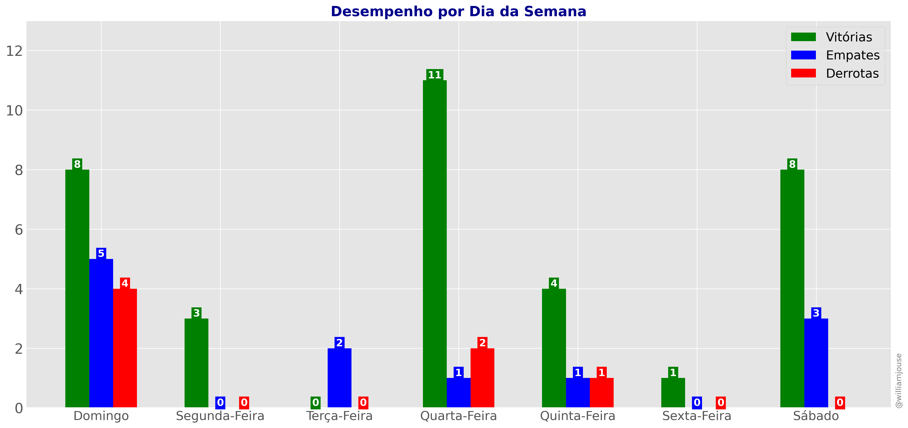

# 🔴⚫ Jogos do Flamengo temporada 2025

Bem-vindo ao repositório **Jogos do Flamengo**! Este projeto contém dados e 
sobre as partidas da temporada 2025 do Flamengo.

## 📋 Descrição

Este repositório contém dados e scripts que auxiliam na coleta, organização e análise de informações sobre os jogos do Flamengo, incluindo:

- Resultados de partidas
- Adversários
- Datas e locais dos jogos
- Gols marcados e sofridos
- Estádio, público

## 🚀 Funcionalidades

- Acesso a um banco de dados de jogos da temporada 2025
- Estatísticas das partidas
- Artilharia e assistência dos jogadores 
- Visualização dos gols sofridos e marcados
- Comparação de desempenho em diferentes campeonatos
- Desempenho por mês
- Visualização de estatísticas dos jogadores e da equipe

## 📦 Estrutura do Repositório

A estrutura básica do repositório é a seguinte:

```bash
/
├── data/raw/        # Arquivos CSV com os dados dos jogos
├── notebooks/       # Jupyter notebooks com análises
├── figures/         # Gráficos e outras imagens
└── README.md        # Documentação principal
```

## ⚙️ Tecnologias Utilizadas

- Python: Linguagem principal para coleta e processamento de dados
- Pandas: Biblioteca para manipulação de dados
- Matplotlib/Seaborn: Visualização de gráficos e estatísticas
- Jupyter Notebook: Para criar e compartilhar análises

## 🗂️ Fontes de Dados

Os dados dos jogos do Flamengo podem ser obtidos de várias fontes, como:

- [Sofascore](https://www.sofascore.com/)
- [Fotmob](https://www.fotmob.com/)
- [ge](https://ge.globo.com/)
- [Flashscore](https://www.flashscore.com)


## Estatísticas

```

```


## Gráficos





